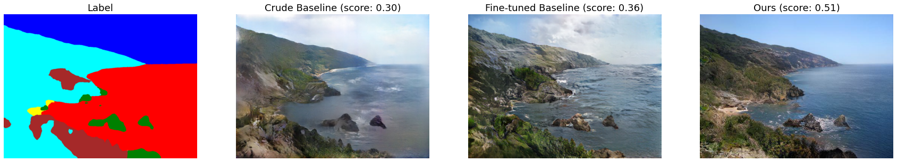

# Jittor Landscape Generation with TSIT



## Introduction

This repository provides the implementation of Team **GAN!** in
- [Jittor AI Contest](https://www.educoder.net/competitions/index/Jittor-3) Track 1: Landscape Generation

We implemented our model based on [TSIT](https://github.com/EndlessSora/TSIT) network architecture, and have achieved a score of 0.5189 in Track 1.

Download our [results]().

## Install and Validate
### Environments

We train and evaluate our model in the following environments.

The total training time is estimated to be 65 ~ 70 hours and inference time is about several minutes.

#### Training
Models are trained on 
- Ubuntu 20.04 LTS
- python 3.8.13
- jittor 1.3.4.15
- Open MPI 4.0.3
- CUDA 11.6

with GPU
- NVIDIA A100-SXM4-40GB

Note that this environment failed the following unittests
- `test_conv_transpose3d` (\__main\__.TestCudnnConvOp)
- `test_conv3d` (\__main\__.TestCudnnConvOp)

due to low precision.

#### Evaluation
Models are evaluated on 
- Ubuntu 20.04 LTS
- Python 3.7.13
- jittor 1.3.4.9
- CUDA 11.6

with GPU
- NVIDIA GeForce RTX 3090

This environment shall pass the unittest of jittor successfully.


### Packages

```
pip install -r requirements.txt
```

### Testing Pretrained Models

We trained **two separate models** and **manually mixed their result** to form our final submission. To reproduce our result, you can

1. Download our [pretrained models]() and unzip them to `./checkpoints` so that the directory looks like
   ```bash
   .
   └──checkpoints
      └── sis_landscape
          ├── aux_net_E.pkl
          ├── aux_net_G.pkl
          ├── main_net_E.pkl
          └── main_net_G.pkl
   ```
   Note that if *_net_D (Discriminator) is not necessary at evaluation.
2. Download the [test dataset]().
3. Config the path of dataset in `validation.sh`. It would evaluate the models on test dataset and call `selection.py` to reproduce our manual selection process.
4. Run
   ```bash
   bash validation.sh
   ```
5. The result will be ready at `./result.zip`

## Dataset Preprocessing

We made no modifications to the images provided, but we manually constructed three subsets of the training set, i.e.

1. `Total`. Containing the original 10,000 images.
2. `Selection I`. Manually remove some images from `Total`, 8115 images left.
3. `Selection II`. Based on `Selection I`, removed more images. Contains 7331 images.

Download our [preprocessed training sets]()

## Training Scripts

Train on single GPU
```
bash ./train.sh
```

Train on multiple GPUs.
```
bash ./multi.sh
```

### About our training process
Our training for model `main` involves 4 phases

| Phase | Epoch     | batch_size | training set   |
|-------|-----------|------------|----------------|
| I     | [1, 38]   | 2          | `Total`        |
| II    | (38, 71]  | 30         | `Selection I`  |
| III   | (71, 95]  | 5          | `Selection II` |
| IV    | (95, 110] | 5          | `Selection I`  |

This is **not** a carefully designed schedule. It is a compromise of our remaining time, access to calculation power and temporary thoughts.

## Inference Scripts
Config and run
```
bash ./test.sh
```
And results will be compressed into a 7zip file.


## Acknowledgement

The implementation of this repository is based on TSIT ([[Code Base]](https://github.com/EndlessSora/TSIT)   [[Paper]](https://arxiv.org/abs/2007.12072)). You may somehow view it as an incomplete "style-transfer" from its original pytorch implementation to jittor framework.

Our spectral normalization uses the implementation of  [[PytorchAndJittor]](https://github.com/Lewis-Liang/PytorchAndJittor).
